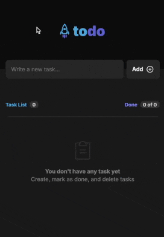

# React To-Do List

<div>
  <a href="https://github.com/martonpaulo/react-todo-list/blob/main/LICENSE">
    
  </a>

  <a href="https://github.com/martonpaulo/react-todo-list/commits/main/">
    
  </a>

  <a href="https://github.com/martonpaulo/react-todo-list/blob/main/package.json">
    
  </a>

  <a href="https://github.com/search?q=repo%3Amartonpaulo%2Freact-todo-list++language%3ATypeScript">
    
  </a>
</div>

<div>
  <a href="https://github.com/martonpaulo/react-todo-list/actions/workflows/deploy.yml">
    
  </a>
</div>

<br />

Welcome to the **React To-Do List** project! 🚀 This project simulates a social media feed, featuring functionalities such as commenting, applauding, and deleting comments. It is a React application using Vite, designed to practice important React concepts, including componentization, props, state, immutability, and hooks. Additionally, TypeScript is applied to add static typing to the application.

<br />



<br />

Inspired by a tutorial from [RocketSeat](https://www.rocketseat.com.br/).

Initial design available on [Figma](https://www.figma.com/design/LEqdd2mzfcSPJn0LnT1Vbl/React-To-Do-List).

This is a sleek and modern feed application built using the latest web technologies: **React**, **TypeScript**, **Vite** and **CSS Modules**.

## 🌐 Live Project

This project is integrated with the GitHub Pages workflow. Once a commit is made, it is deployed and hosted by GitHub Pages.

Live project at: [martonpaulo.github.io/react-todo-list](https://martonpaulo.github.io/react-todo-list)

For more information about me and other projects, check out: [martonpaulo.com](https://martonpaulo.com)

## 🚀 Getting Started

To start working on this project, clone the repository and install the dependencies:

```bash
git clone https://github.com/martonpaulo/react-todo-list.git
cd react-todo-list
npm install
```

## 📜 Available Scripts

In the project directory, you can run the following scripts:

- `npm run dev` - Start the development server at `http://localhost:3000/react-todo-list`
- `npm run build` - Build the project for production, outputting to the `dist` folder
- `npm run lint` - Lint the project using ESLint

## 🔧 To Be Implemented

Future improvements to consider:

- [ ] Add Screen Recording to the README file 📹
- [ ] Add .yml workflow & host the project on GitHub Pages 🌐
- [x] Add License to the project 📜
- [ ] Add Favicon to the project 🌐
- [ ] Add Google Fonts to the project 🌐
- [ ] Add description to the project 📝
- [ ] Write the About section in GitHub 📄
- [ ] Add the project to the portfolio 📂

## 📄 License

This project is licensed under the MIT License. See the [LICENSE](LICENSE) file for more information.
